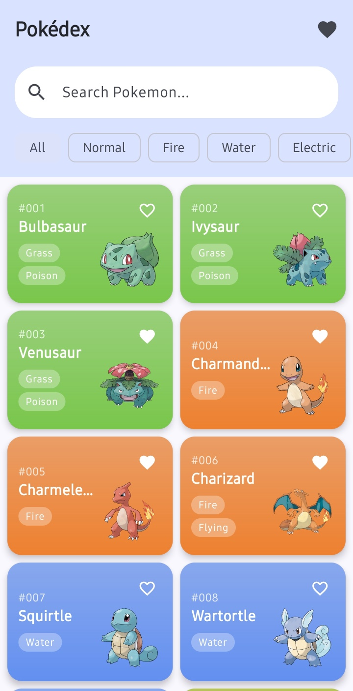
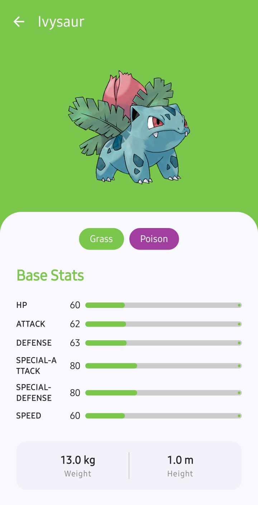
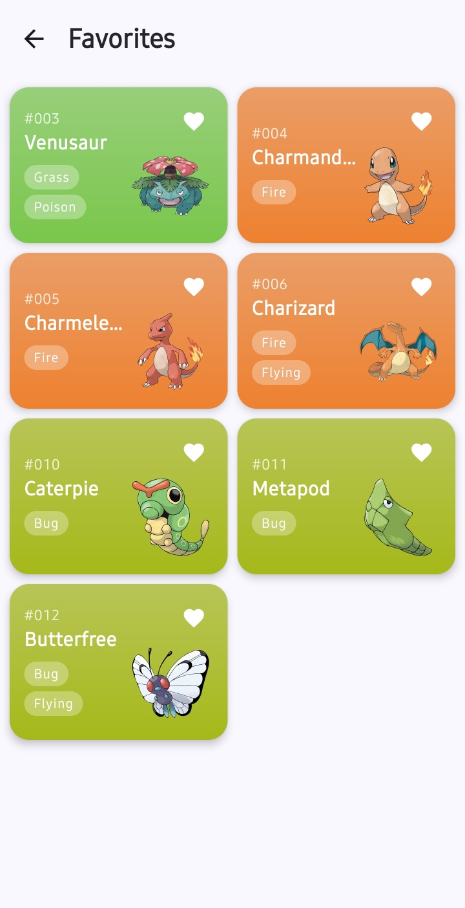

# 📱 PokeDex-MVI

> **PokeAPI를 활용한 오프라인 우선(Offline-first) 포켓몬 도감 안드로이드 프로젝트**

이 프로젝트는 대규모 앱에서도 유지보수와 테스트가 용이하도록 설계된 **MVI (Model-View-Intent)** 아키텍처와 **멀티 모듈(Multi-Module)** 구조를 깊이 있게 학습하고 실무에 적용하기 위해 개발되었습니다.

---

## 🌟 Key Features

- **Pokemon Paging List:** `Paging3` 및 `RemoteMediator`를 활용한 대용량 데이터의 효율적인 무한 스크롤 및 네트워크-로컬 DB 동기화.
- **Search & Filter:** 포켓몬 이름 검색 및 타입별 필터링 기능을 통한 데이터 탐색.
- **Offline Support:** 네트워크 연결 없이도 기존에 로드된 데이터를 탐색할 수 있는 `Room` 기반 로컬 캐싱.
- **Dynamic UI:** 포켓몬 고유 타입에 맞춘 동적 테마 컬러링 및 `Jetpack Compose` 애니메이션을 활용한 스탯 시각화.
- **Favorites:** 관심 있는 포켓몬을 즐겨찾기에 등록하고 관리하는 기능.

---

## 🛠 Tech Stacks

- **Language:** [Kotlin](https://kotlinlang.org/)
- **UI:** [Jetpack Compose](https://developer.android.com/jetpack/compose) (Declarative UI)
- **Architecture:** MVI (Model-View-Intent), Clean Architecture, Multi-Module
- **Build & Infra:** Kotlin DSL, Convention Plugins (build-logic), Version Catalog
- **DI:** [Hilt](https://developer.android.com/training/dependency-injection/hilt-android)
- **Networking:** [Retrofit2](https://square.github.io/retrofit/), OkHttp3, Kotlinx Serialization
- **Local Storage:** [Room](https://developer.android.com/training/data-storage/room) (SQLite)
- **Async & Stream:** Coroutines, Flow (StateFlow, SharedFlow)
- **Image Loading:** [Coil3](https://coil-kt.github.io/coil/)
- **Pagination:** Paging3 (RemoteMediator for offline caching)
- **Testing:** [JUnit4](https://junit.org/junit4/), [MockK](https://mockk.io/), [Turbine](https://github.com/cashapp/turbine) (Flow testing)

---

## 🏗 Architecture & Design

### 1. Build Logic & Convention Plugins

멀티 모듈 프로젝트의 빌드 복잡도를 제어하기 위해 `build-logic`을 도입하여 **빌드 인프라를 코드로서 관리(IaC)**했습니다.

- **Convention Plugins:** 반복되는 빌드 설정을 플러그인화하여 모듈 간 일관성 유지 및 유지보수성 극대화.
- **Type-Safe 의존성 관리:** Version Catalog를 활용하여 라이브러리 버전 파편화 방지.
- **관심사 분리:** 모듈의 성격(Data, Feature, UI)에 맞는 빌드 로직을 분리하여 `build.gradle.kts` 가독성 개선.

### 2. MVI (Model-View-Intent)

상태 파편화(State Fragment)를 방지하고 예측 가능한 UI 상태 관리를 위해 **단방향 데이터 흐름(UDF)**을 보장했습니다.

- **Single Source of Truth:** UI의 모든 상태를 `UiState`라는 단일 객체로 관리하여 데이터 불일치 해결.
- **Intent-Driven:** 사용자의 액션을 캡슐화하여 비즈니스 로직으로 전달하고, 복잡한 상태 변화를 예측 가능하게 설계.
- **Side Effect Handling:** 네비게이션, 스낵바 등 휘발성 이벤트를 `UiEffect`로 분리하여 안정적인 처리 프로세스 구축.

### 3. Multi-Module Structure

관심사 분리(SoC)와 빌드 속도 최적화를 위해 기능 및 레이어별로 모듈 결합도를 낮췄습니다.

- **`app`**: 통합 모듈. DI 진입점 및 전체 네비게이션 관리.
- **`build-logic`**: Convention Plugins를 통한 빌드 인프라 관리.
- **`core:common`**: 프로젝트 전반에서 재사용되는 확장 함수, 유틸리티 및 공통 인터페이스.
- **`core:data`**: 리포지토리 패턴을 통해 다양한 데이터 소스(Network, Database)를 통합 및 관리.
- **`core:database`**: Room 기반의 로컬 영속성 관리 및 데이터베이스 엔티티 정의.
- **`core:designsystem`**: 공통 UI 컴포넌트, 테마(Color, Typography), 디자인 가이드라인 정의.
- **`core:domain`**: 비즈니스 로직 및 UseCase 정의. 프레임워크 의존성이 없는 Pure Kotlin 모듈.
- **`core:model`**: 프로젝트 전반에서 사용되는 공통 도메인 모델 및 Enum 정의.
- **`core:network`**: Retrofit 기반의 외부 API 통신 및 네트워크 데이터 모델 정의.
- **`core:ui`**: 디자인 시스템 기반의 공통 UI 컴포넌트 및 복합 UI 로직 관리.
- **`feature:*`**: 기능 단위 모듈 (`list`, `detail`, `favorites`). UI 로직(Compose) 및 ViewModel 포함.

---

## 🧪 Testing Strategy

신뢰성 있는 앱을 위해 계층별 테스트 전략을 수립하고 자동화된 검증 환경을 구축했습니다.

- **Unit Testing:** `JUnit4` 및 `MockK`를 활용하여 UseCase와 Repository의 비즈니스 로직 정합성 검증.
- **MVI State Flow Testing:** `Turbine`을 활용하여 사용자 Intent에 따른 `UiState`의 변화와 `UiEffect` 방출의 순차적 흐름 검증.
- **Coroutine Test:** `kotlinx-coroutines-test`의 `runTest`를 도입하여 비동기 작업에 대한 결정론적 테스트 수행.
- **Behavioral Verification:** UseCase가 Repository와 상호작용할 때 의도한 횟수만큼 올바르게 호출되는지 검증.

---

## 🚀 Technical Challenges & Learnings

- **RemoteMediator를 통한 오프라인 최적화:** 네트워크와 로컬 DB 사이의 동기화 전략을 구축하여 데이터 신뢰성 확보.
- **멀티 모듈 네비게이션 설계:** 모듈 간 결합도를 낮추면서 유연한 화면 이동을 보장하기 위한 라우팅 인터페이스 설계 및 적용.
- **Convention Plugins 도입:** 빌드 로직의 중복을 제거하고 모듈 확장 시 빌드 설정 비용을 획기적으로 단축.

---

## 📸 Screenshots

|                       포켓몬 리스트                        |                         상세 정보                          |                           즐겨찾기                            |
|:----------------------------------------------------:|:------------------------------------------------------:|:---------------------------------------------------------:|
|  |  |  |

---

## 🛠 Getting Started

1. 이 저장소를 클론합니다.
2. Android Studio (Ladybug 이상 권장)에서 프로젝트를 엽니다.
3. Gradle Sync를 완료한 후 `app` 모듈을 실행합니다.
